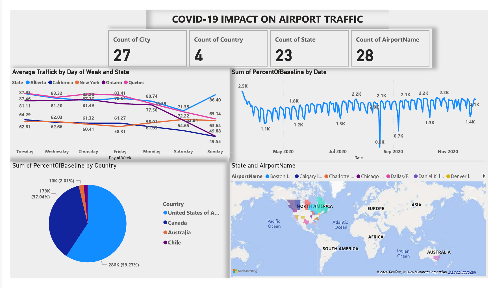

# 🛫 COVID-19 Impact on Airport Traffic

## 📘 Overview

This dashboard presents a data-driven analysis of how COVID-19 affected airport traffic across North and South America. It highlights variations in **passenger traffic**, **geographic impact**, and **week-by-week trends**, enabling stakeholders to assess the pandemic's effects on the aviation industry.

---

## 📊 Key Metrics

* 🏙️ **Cities Covered**: 27
* 🌎 **Countries Analyzed**: 4
* 🗺️ **States Tracked**: 23
* 🛬 **Airports Included**: 28

---

## 📈 Visual Insights

### 📅 **Average Traffic by Day of Week and State**

* **California and Alberta** consistently maintain high weekday traffic averages.
* **New York, Ontario, and Quebec** show lower traffic, especially by Friday and Saturday.

### 📆 **Traffic Trends by Date**

* Sharp decline in **September 2020**, dropping to **0 baseline traffic** — likely due to travel bans or lockdown surges.
* Recovery shows fluctuations, peaking back to \~2.2K in **July–November 2020**.

### 🌍 **Country-wise Percent of Baseline Traffic**

* **United States**: 59.27%
* **Canada**: 37.04%
* **Australia** & **Chile**: Below 2.1% combined, suggesting limited participation or minimal traffic.

### 🗺️ **Geospatial Mapping of Airport Locations**

* Airports are plotted interactively across **North America**, **Australia**, and **Chile**.
* Most airport data is concentrated in **U.S. and Canada**.

---

## 🧠 Use Cases

* **Aviation Policy Planning**: Track regional disruptions for future crisis planning
* **Airport Operations**: Reallocate resources based on historical drops
* **Airline Strategy**: Identify rebound points and travel pattern normalization
* **Public Health Impact**: Gauge travel restrictions' effectiveness across time

